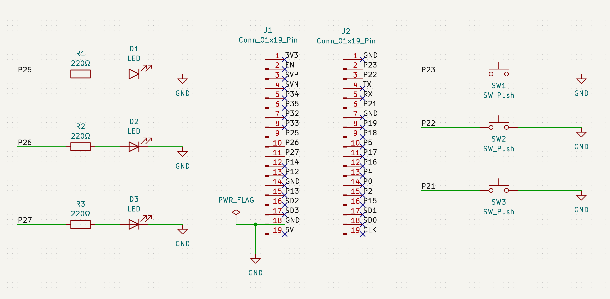
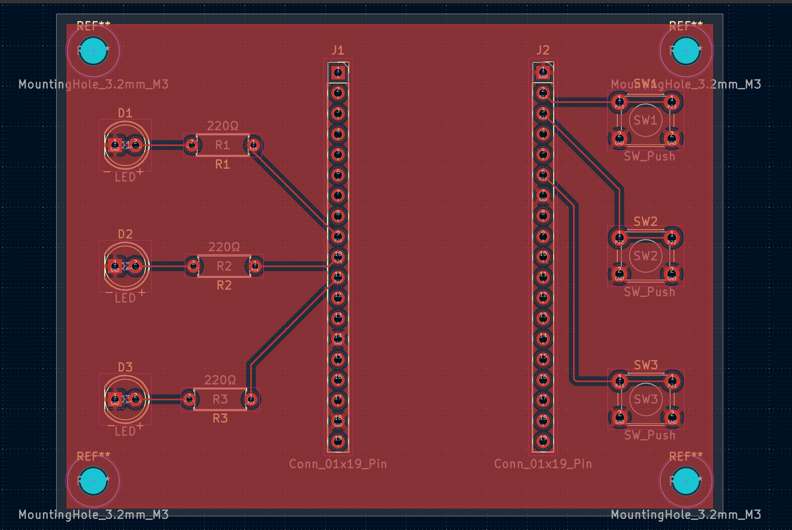
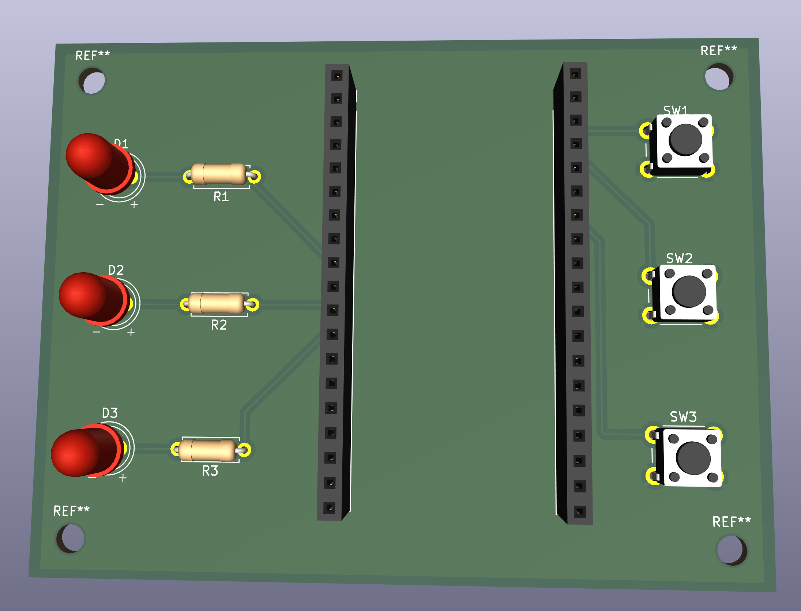
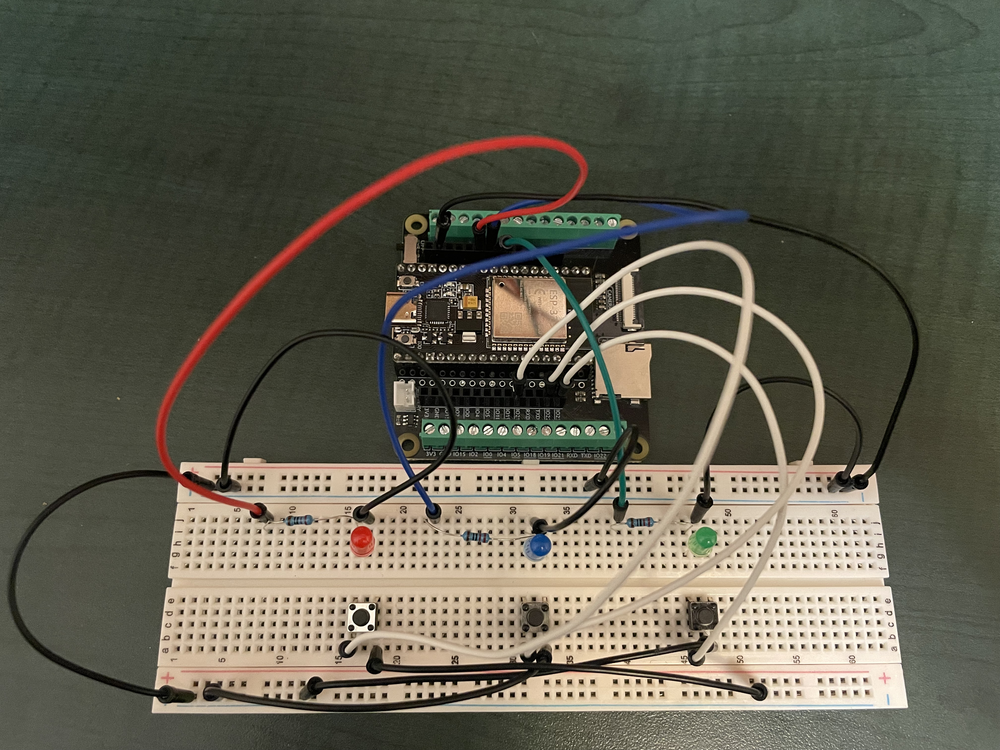

# Memory Game Revision - PCB Design

A custom ESP32-based memory game built on a hand-designed PCB.  
This is a learning project covering embedded firmware, schematic design, and PCB layout.

> **PCB prototype sponsored by [PCBWay](https://www.pcbway.com)**

---

## Project Status

| Stage | Status |
|-------|--------|
| Breadboard prototype | ✅ Complete |
| Hardware test firmware | ✅ Complete |
| KiCad schematic | ✅ Complete |
| PCB layout | ✅ Complete |
| PCB manufacturing | 🔄 In progress (PCBWay) |
| Final game logic firmware | ⏳ Planned |

---

## Hardware Overview

- **Microcontroller:** ESP32-WROOM-32E dev board (removable via female socket headers)
- **Inputs:** 3 tactile pushbuttons (GPIO 21, 22, 23)
- **Outputs:** 3 LEDs with 220Ω current-limiting resistors (GPIO 25, 26, 27)
- **PCB:** Custom 2-layer board designed in KiCad 10, manufactured by PCBWay
- **Power:** USB via ESP32 dev board

### GPIO Mapping

| Component | GPIO |
|-----------|------|
| SW1 | 23 |
| SW2 | 22 |
| SW3 | 21 |
| D1 | 25 |
| D2 | 26 |
| D3 | 27 |

---

## PCB Design

Designed in **KiCad 10.0.0**. 2-layer FR4 board, 82.5 × 62.2mm.

- All through-hole components for beginner-friendly hand soldering
- Female socket headers allow the ESP32 dev board to remain removable and reusable
- F.Cu GND copper pour
- 4× M3 mounting holes at corners

### Schematic


### PCB Layout


### 3D Render


---

## Breadboard Prototype

Initial hardware validation was done on a breadboard before PCB design.



---

## Firmware

### Current: Hardware Test
Located in [`memory_game/firmware/hardware_test/`](memory_game/firmware/hardware_test/)

Tests button inputs and LED outputs — each button lights its corresponding LED when pressed.

### Planned: Game Logic
The final memory game firmware will be added to [`memory_game/firmware/game_logic/`](memory_game/firmware/game_logic/) after hardware is validated.

---

## Repository Structure

```text
memory-game-pcb/
└── memory_game/
    ├── firmware/
    │   ├── hardware_test/     # Current test firmware
    │   └── game_logic/        # Final game firmware (coming soon)
    ├── hardware/
    │   ├── kicad/             # KiCad schematic and PCB files
    │   └── gerbers/           # Gerber files for manufacturing
    ├── docs/
    │   └── images/            # Project photos and renders
    └── bom/
        └── bom.md             # Bill of materials
```

---

## Sponsor

<a href="https://www.pcbway.com">
  
</a>

PCB prototypes for this project are sponsored by **[PCBWay](https://www.pcbway.com)**.  
- PCBWay provides high-quality PCB manufacturing and assembly services for makers, hobbyists, and professionals.  
- I'll be sharing my honest review of the manufacturing quality and experience once the boards arrive.

---

## License

MIT License — see [LICENSE](LICENSE) for details.
